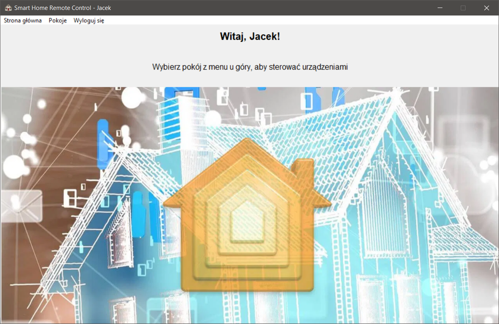
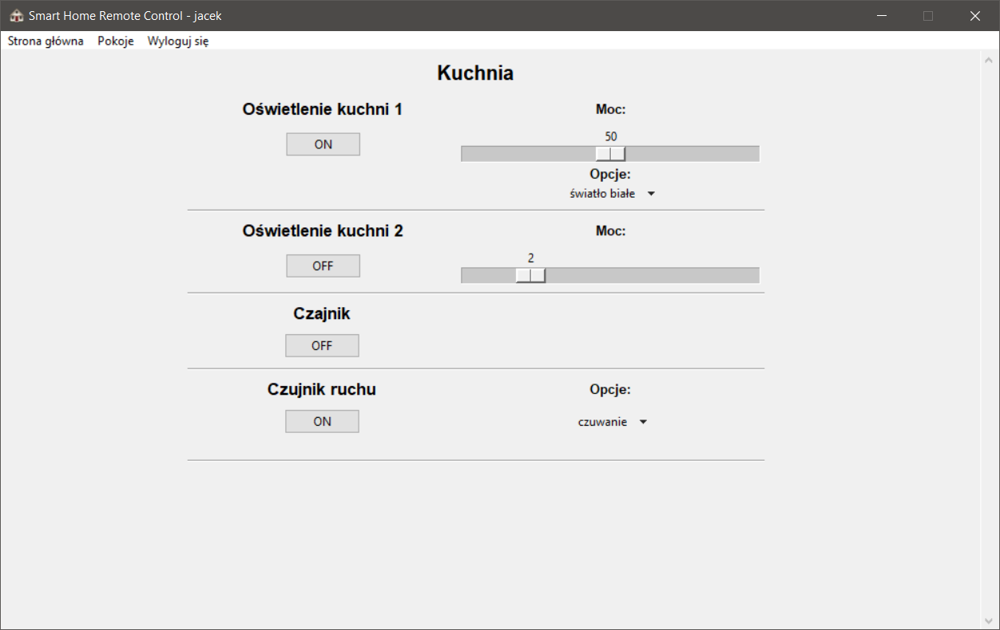
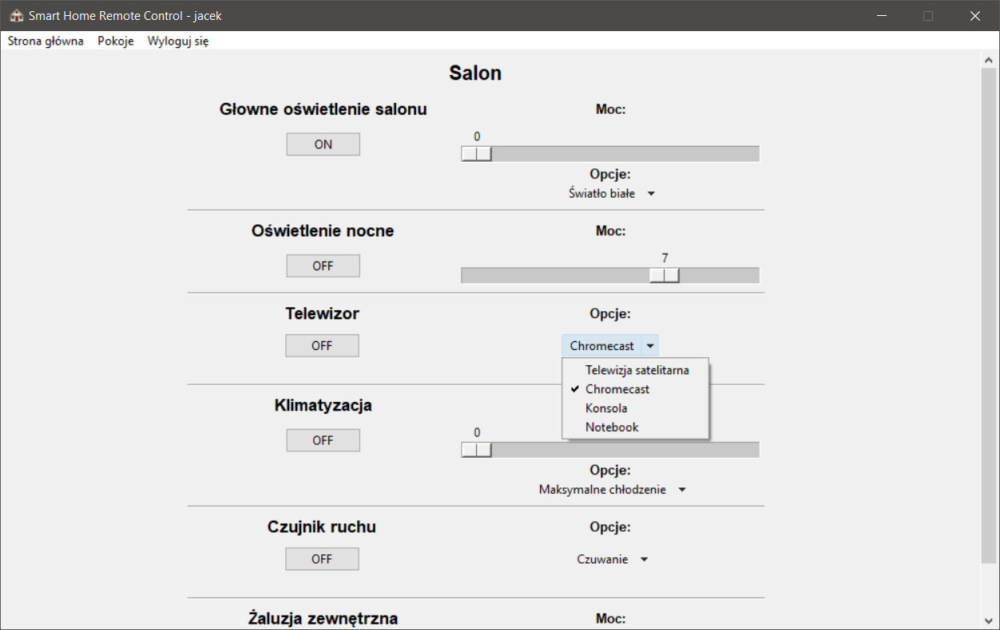
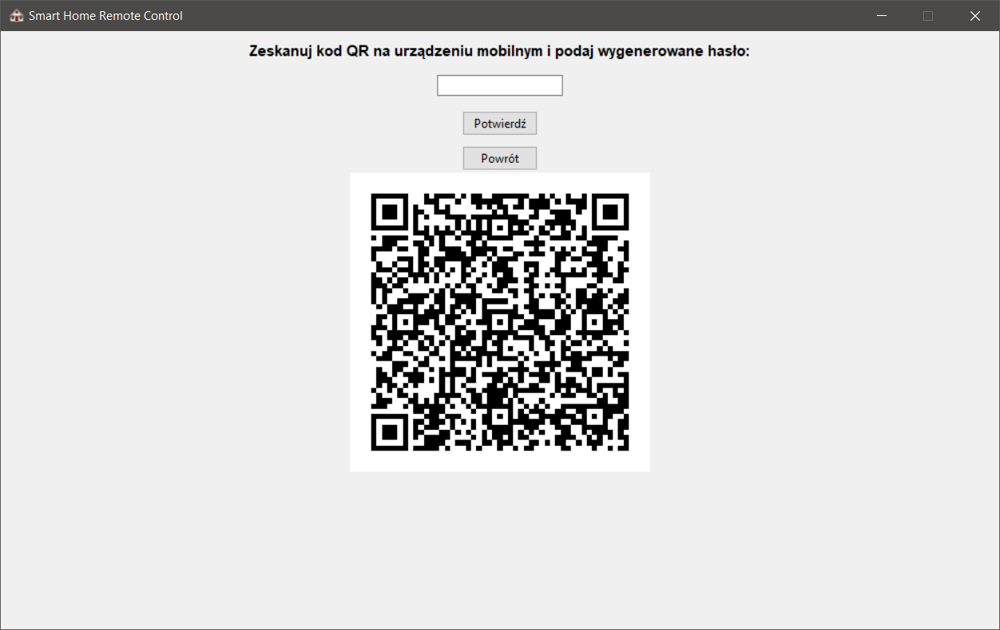
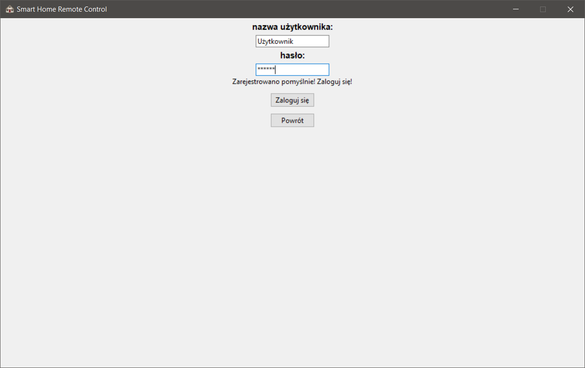

# Smart Home Remote Control

Aplikacja jest projektem w ramach przedmiotu "Programowanie w języku Python". Pozwala użytkownikowi wysyłać komendy do
brokera MQTT w celu sterowania urządzeniami wchodzącymi w skład "Smart Home", a także odbiera zmiany ustawień z brokera 
i aktualizuje je w czasie rzeczywistym.

Program używa uwierzytelnienia dwuetapowego i przechowuje dane o użytkownikach w bazie danych MongoDB Atlas.
Aby uruchomić aplikację z funkcjonalnością logowania, konieczne jest posiadanie tokena dostępnowego do MongoDB Atlas.

W celu uruchomienia aplikacji bez funkcjonalności logowania, w pliku `main.py` należy w 24 linijce zmienić `None` na 
własną nazwę użytkownika - aplikacja uruchomi się wtedy z pominięciem logowania, a dostęp do internetu nie będzie 
wymagany. 

## Konfiguracja Smart Home
Konfiguracja programu jest wczytywana z pliku `config.json`. Jego zawartość ma następującą postać:
```
[{
"name": "<Nazwa pomieszczenia>",
"id": "<Id pomieszczenia>",
"devices": [
    {
      "name": "<Nazwa urządzenia>",
      "type": "<typ>",
      "id": "<id urządzenia>",
      "settings": {
        "status": "<ON/OFF>",
        "power_max": <Maksymalna moc>,
        "power": <Domyślna moc>,
        "props": [
          "<Opcja 0>",
          "<Opcja 1>",
          "<Opcja 2>"
        ],
        "prop": <Nr opcji domyślnej >
      }
    },
    {
      "name": "Oświetlenie kuchni 2",
      "type": "light",
      "id": "light2",
      "settings": {
        "status": "OFF",
        "power_max": 10,
        "power": 2
      }
    },
]
},
{
<kolejne pomieszczenie>
...
}]
```

Każde urządzenie ma następujące opcje:

- `name` - nazwa urządzenia - widoczna w pilocie
- `type` - typ urządzenia - może być dowolny, obecnie nie jest wykorzystywany, ale może być użyty w przyszłości
- `id` - identyfikator urządzenia - używany w komunkatach do brokera MQTT
- 'settings' - możliwe ustawienia urządzenia:
    - `status` - domyślny stan urządzenia
    - `power_max` - [opcjonalne] liczba poziomów mocy urządzenia (od `0` do `power_max`)
    - `power` - [opcjonalne] domyślna moc urządzenia 
    - `props` - [opcjonalne] tablica z dostępnymi opcjami urządzenia - np. źródło sygnału w w TV.
    - `prop` - [opcjonalne] domyślna opcja urządzenia

W przypadku błędnego pliku `config.json` uruchomienie programu nie będzie możliwe.
Przykładowy plik `config.json` załączony jest do projektu.

## Komunikaty do brokera MQTT
Po zmianie statusu urządzenia wysyłany jest komunikat do brokera MQTT o temacie:
`/msg/<id_pomieszczenia>/<id_urządzenia>` i komunikacie `<komunikat>`,
gdzie:
- `id_pomieszczenia` - konfigurowane w pliku `config.json` jako wartość atrybutu `id` dla pomieszczenia.
- `id_urządzenia` - konfigurowane w pliku `config.json` jako wartość atrybutu `id` dla urządzenia.
- `komunikat` - Definiowany następująco:
    - zmiana statusu *(on/off)* - odpowiednio `on` lub `off`
    - zmiana mocy - `<wartość nowej mocy>` np. `10`
    - zmiana ustawienia - `p<numer nowego ustawienia>` np. `p0` 
    

Wysłany komunikat może wyglądać przykładowo:

* temat:`cmd/kitchen/light2`
* treść: `on`

Program oprócz wysyłania odbiera od brokera te komunikaty, które sam potrafi wysłać - pobrane z pliku konfiguracyjnego.
W przypadku zaistnienia zmiany statusu danego urządzenia informacja ta jest pokazywana użytkownikowi w czasie 
rzeczywistym. 

**Uwaga!** W przypadku zmiany mocy urządzenia, z racji dużej ilości komunikatów przy *płynnej* zmianie mocy,
informacja o zmianie jest widoczna dopiero po odświeżeniu strony pomieszczenia.

## Interfejs programu
Interfejs został zbudowany przy użyciu biblioteki `TKinter`. Aplikacja prezentuje się następująco:
#### Ekran główny:


#### Sterowanie urządzeniami:




#### Rejestracja:


#### Logowanie:


## Instrukcje uruchomienia
- `pip install -r requirements.txt`
- Utwórz plik `.env` w głównym folderze projektu z następującą zawartością:
  ```
  export CONNECTION_STRING=<your mongoDB Atlas string>
  export MQTT_HOST=<host>
  export MQTT_PORT=<port>
  ```
- `python main.py`
---
Autor: Jacek Nitychoruk
